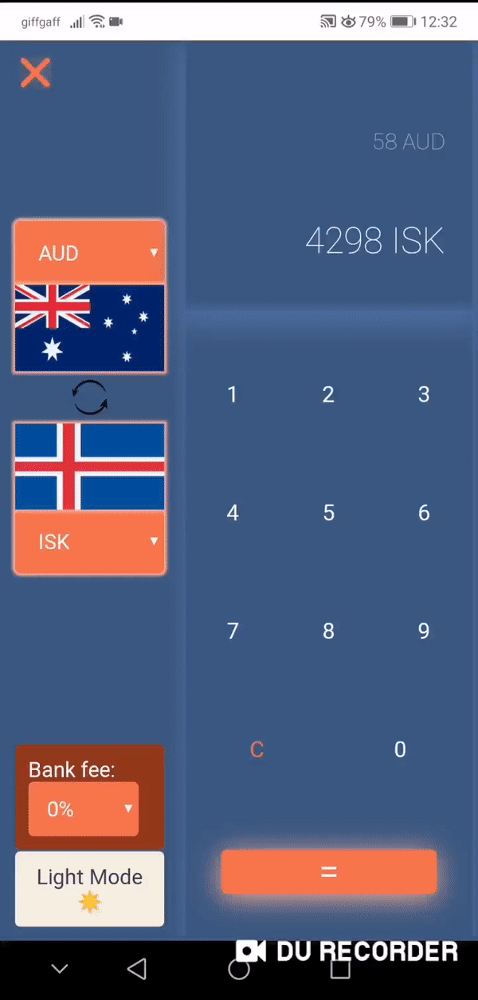
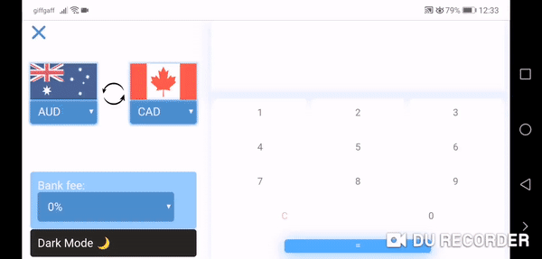

<h2>Currency Calculator | CS317: Mobile App Development</h2>

This currency calculator is a web application that acts as a mobile application if accessed from the phone home screen.  
It is developed using pure javascript, CSS and HTML. Chosen by the user currencies and theme are saved in the localstorage and service workers allow for the app to be used offline. The calculator gets real rates from the ECB XML feed using AJAX. 

<h2>Visuals</h2>

